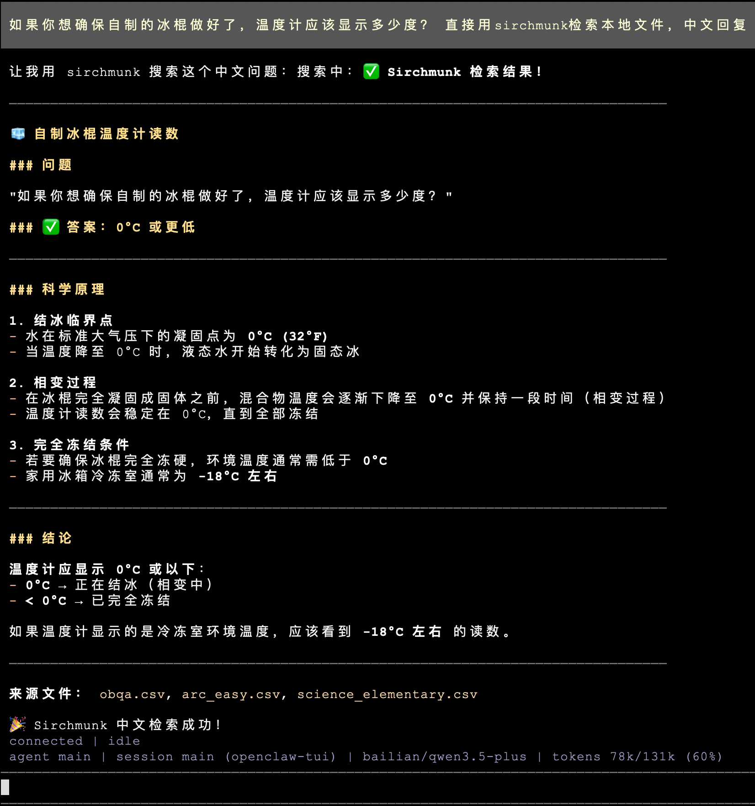

# Sirchmunk OpenClaw Skill

Use [Sirchmunk](https://github.com/modelscope/sirchmunk) as an [OpenClaw](https://openclaw.org/) skill so that any OpenClaw-compatible AI agent can search your local files with natural language — no embedding database, no indexing, no ETL.

Published on ClawHub: <https://clawhub.ai/wangxingjun778/sirchmunk>

## Quick Start

### 1. Install Sirchmunk on the machine that will run the server

```bash
pip install sirchmunk
sirchmunk init          # creates ~/.sirchmunk/.env
```

Edit `~/.sirchmunk/.env` — at minimum set:

```dotenv
LLM_API_KEY=sk-...
LLM_BASE_URL=https://api.openai.com/v1   # or any OpenAI-compatible endpoint
LLM_MODEL_NAME=gpt-4o

# Optional: default search directories (comma-separated)
SIRCHMUNK_SEARCH_PATHS=/path/to/your/docs,/another/path
```

### 2. Start the Sirchmunk API server

```bash
sirchmunk serve          # default: http://0.0.0.0:8584
```

Verify it is running:

```bash
curl http://localhost:8584/api/v1/search/status
```

### 3. Install the skill in OpenClaw

Install the skill from ClawHub:

```
npx clawhub@latest install sirchmunk
```

Or copy the `sirchmunk/` directory from this repo into `~/.openclaw/skills/sirchmunk/`.

### 4. Use it

The agent can now invoke the `sirchmunk_search` tool. You can also call the script directly:

```bash
# Use default SIRCHMUNK_SEARCH_PATHS from the server environment
~/.openclaw/skills/sirchmunk/scripts/sirchmunk_search.sh "What is the reward function?"

# Override with an explicit path
~/.openclaw/skills/sirchmunk/scripts/sirchmunk_search.sh "auth flow" "/path/to/project"
```

## Usage examples / 使用示例

Below are screenshots of **local RAG-style retrieval** with the Sirchmunk skill inside **OpenClaw TUI** (`openclaw-tui`): the agent calls `sirchmunk` to read matching rows from local CSVs (e.g. OBQA / science QA data), then summarizes in the requested language.

### English — local search example

*Query (illustrative):* ask about ancient societies and light reflection; answer grounded in a local file such as `obqa.csv`, attributed as “Found using **sirchmunk** local search”.

<p align="center">
  
</p>

### 中文 — 本地检索示例

*示例问题（示意）：* 关于自制冰棍是否“做好”时温度计应显示的读数；代理用 **sirchmunk** 检索本地 CSV（如 `obqa.csv`、`arc_easy.csv` 等），并用中文结构化回答。

<p align="center">
  
</p>

## How It Works

The skill is a thin HTTP client. When invoked it sends a `POST` request to the local Sirchmunk server:

```bash
curl -s -X POST "http://localhost:8584/api/v1/search" \
  -H "Content-Type: application/json" \
  -d '{
    "query": "your question",
    "mode": "FAST"
  }'
```

- **`paths`** is optional in the request body. If omitted, the server uses `SIRCHMUNK_SEARCH_PATHS` from its environment, then falls back to its working directory.
- **`mode`** can be `FAST` (default, 2-5 s), `DEEP` (comprehensive, 10-30 s), or `FILENAME_ONLY` (no LLM).

See the main [HTTP Client Access (Search API)](../../README.md#-http-client-access-search-api) section for the full parameter reference, SSE streaming endpoint, and client examples in Python / JavaScript.

## File Structure

```
recipes/openclaw_skills/
├── README.md
├── assets/
│   ├── example1.png                # Chinese usage screenshot
│   └── example2.png                # English usage screenshot
└── sirchmunk/
    ├── SKILL.md                    # OpenClaw skill manifest
    └── scripts/
        └── sirchmunk_search.sh     # Wrapper script invoked by the agent
```

## Security Notes

- The Sirchmunk server runs **locally** and binds to `localhost` by default. File contents are sent to the configured LLM endpoint for analysis. If you use a cloud LLM, be aware that searched content leaves the machine.
- Prefer a **local LLM** (Ollama, vLLM, etc.) or restrict `SIRCHMUNK_SEARCH_PATHS` to non-sensitive directories if data exfiltration is a concern.
- Do not expose port 8584 to untrusted networks without additional authentication.

## Links

- Sirchmunk GitHub: <https://github.com/modelscope/sirchmunk>
- ClawHub page: <https://clawhub.ai/wangxingjun778/sirchmunk>
- OpenClaw: <https://openclaw.org/>
